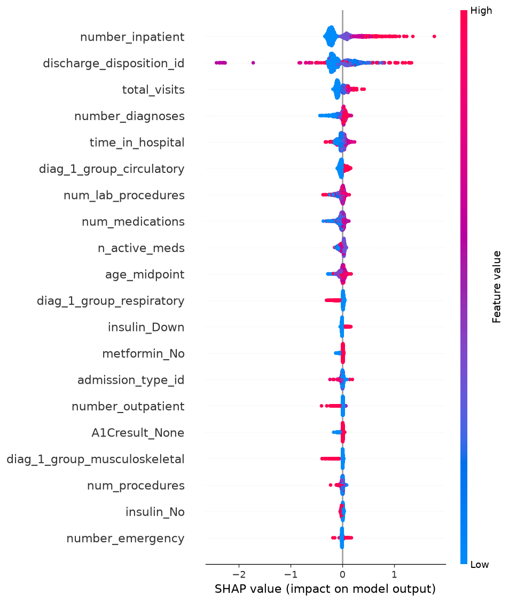
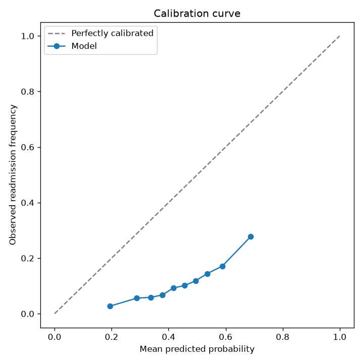
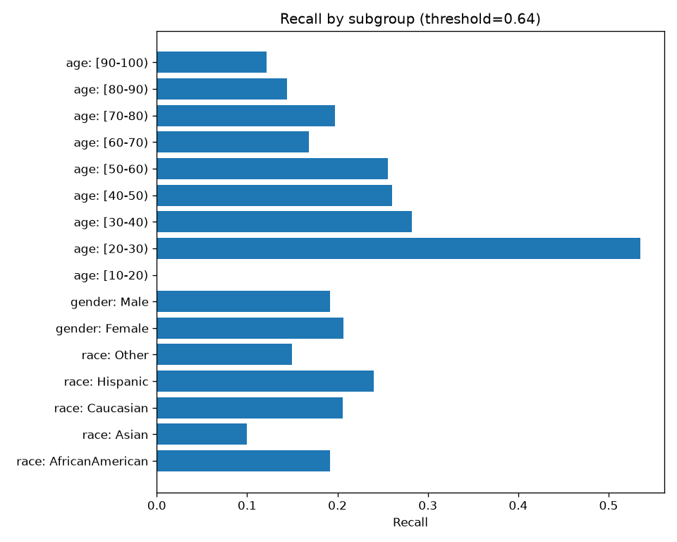
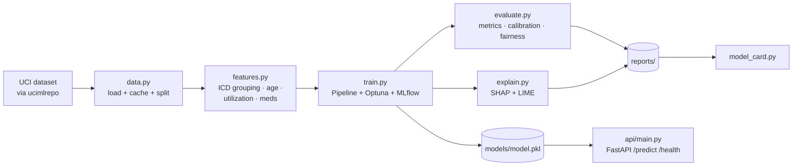

# Readmission Risk, XGBoost + Explainability

[](https://github.com/bushra-nazeer/readmission-risk-xgboost/actions/workflows/ci.yml)


Predicts **30-day hospital readmission risk** from patient-encounter data, with
the things that matter in a real clinical ML system: **probability calibration,
SHAP explainability, subgroup fairness analysis, experiment tracking, and a
deployable scoring API**: all reproducible from public data with one command.

> **What this is:** a self-contained reference implementation on the public
> **UCI Diabetes 130-US Hospitals** dataset (~101K encounters). It demonstrates
> the full technique end-to-end and reports **real, reproducible metrics**: it
> is not a proprietary production system and uses no protected health information.

## Results (held-out test set)

| Metric | XGBoost | Logistic baseline |
|---|---|---|
| **ROC-AUC** | **0.688** | 0.648 |
| PR-AUC | 0.235 |, |
| Brier score | 0.206 |, |
| Precision @ operating threshold | 0.300 |, |
| Recall @ operating threshold | 0.200 |, |

The positive class (readmitted < 30 days) is only **~11%** of encounters, so
PR-AUC and calibration are reported alongside ROC-AUC rather than misleading
accuracy. ROC-AUC ≈ 0.69 is consistent with published results on this dataset -
an honest, reproducible number. Full per-subgroup breakdown is in the
[model card](reports/MODEL_CARD.md).

### Explainability & calibration

| Global SHAP | Calibration | Subgroup recall |
|---|---|---|
|  |  |  |

## What it demonstrates

- **Modeling**: XGBoost + LightGBM with an Optuna hyperparameter search,
  class-imbalance handling (`scale_pos_weight`), and a logistic-regression baseline.
- **Evaluation**: ROC-AUC, PR-AUC, Brier score, calibration curve, and an
  operating threshold chosen to meet a precision target.
- **Explainability**: SHAP global (beeswarm/bar) and local (waterfall) plus a
  LIME example; the same SHAP driver logic powers the API's per-prediction reasons.
- **Fairness**: sliced AUC / recall / false-positive-rate across race, gender, and age.
- **MLOps**: MLflow experiment tracking, an auto-generated model card, a typed
  FastAPI scoring service, Docker, and CI (ruff + pytest).

## Architecture



The persisted artifact is a full `Pipeline(preprocessor, model)`, so the exact
transforms used in training run at serve time, no train/serve skew.

## Demo

An interactive Streamlit app (`streamlit_app.py`) lets you enter a patient and see the risk score with its top SHAP drivers. Run it locally with `streamlit run streamlit_app.py`, or deploy it free on [Streamlit Community Cloud](https://streamlit.io/cloud) by connecting this repo and setting the main file to `streamlit_app.py`.

## Quickstart

### Option A, Docker (no local Python needed)

```bash
# Build + serve the scoring API (model is baked into the image)
docker compose up --build api
# → http://localhost:8000/health   and   POST http://localhost:8000/predict
```

### Option B, local with uv

```bash
make install          # creates a Python 3.12 venv and installs everything
make data             # download + cache the dataset (~once)
make train            # XGBoost + Optuna, logs to MLflow, writes models/model.pkl
make evaluate         # metrics, calibration, fairness -> reports/
make explain          # SHAP + LIME figures -> reports/figures/
make card             # regenerate reports/MODEL_CARD.md
make serve            # FastAPI on :8000
make test             # pytest    |    make lint   # ruff
```

## Using the API

```bash
curl -s localhost:8000/predict -H 'Content-Type: application/json' -d '{
  "race": "Caucasian", "gender": "Female", "age": "[70-80)",
  "time_in_hospital": 5, "num_medications": 12, "diag_1": "428",
  "number_inpatient": 1, "number_diagnoses": 9
}'
```

```json
{
  "risk_score": 0.495,
  "risk_band": "Medium",
  "top_factors": [
    { "feature": "discharge_disposition_id", "contribution": -0.125 },
    { "feature": "diag_1_group_circulatory", "contribution": 0.089 },
    { "feature": "num_medications", "contribution": -0.061 }
  ],
  "model_type": "xgboost"
}
```

Any subset of the raw encounter fields can be posted; unspecified fields fall
back to training-set defaults. Full request schema: `src/readmission/api/schemas.py`.

## Repository layout

```
src/readmission/   config · data · features · train · evaluate · explain · model_card · api/
tests/             unit tests for transforms, metrics, explainability, and the API
config/config.yaml all paths, seeds, and hyperparameters in one place
reports/           committed metrics, fairness table, model card, and figures
docs/              architecture diagram and design spec
```

## Notes on responsible use

This model is decision **support**, not a diagnostic device. It is trained on
1999-2008 US encounters and is not representative of current or non-US
populations. Subgroup performance varies (see the model card) and should be
monitored before any real deployment.

## License

[MIT](LICENSE)
