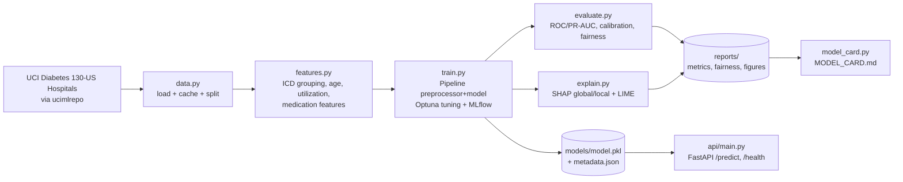

# Architecture

## Pipeline

## Module responsibilities

| Module | Responsibility | Key interface |
|---|---|---|
| `config.py` | Typed settings from `config/config.yaml` | `load_config() -> Config` |
| `data.py` | Fetch/cache dataset; stratified split | `load_raw`, `make_target`, `split` |
| `features.py` | Pure, deterministic feature transforms | `engineer_features`, `build_preprocessor`, `group_icd9` |
| `train.py` | Tune (Optuna), fit, log (MLflow), persist | `train(cfg, model_type) -> metrics` |
| `evaluate.py` | Metrics, calibration, fairness slices | `compute_metrics`, `fairness_report`, `evaluate` |
| `explain.py` | SHAP/LIME artifacts + per-row drivers | `explain`, `top_shap_for_instance` |
| `model_card.py` | Render `MODEL_CARD.md` | `render_model_card`, `write_model_card` |
| `api/` | FastAPI scoring service | `GET /health`, `POST /predict` |

## Design notes

- The persisted artifact is a full `Pipeline(preprocessor, classifier)`, so the
  identical transforms run in training and serving, no train/serve skew.
- `features.py` is intentionally free of I/O and global state so it is trivially
  unit-tested and reused by the API.
- The split is seeded and stratified; `evaluate.py` and `explain.py` reconstruct
  the exact same held-out test set rather than persisting it.
